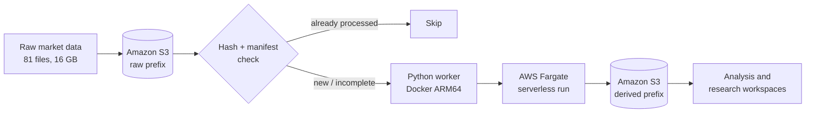
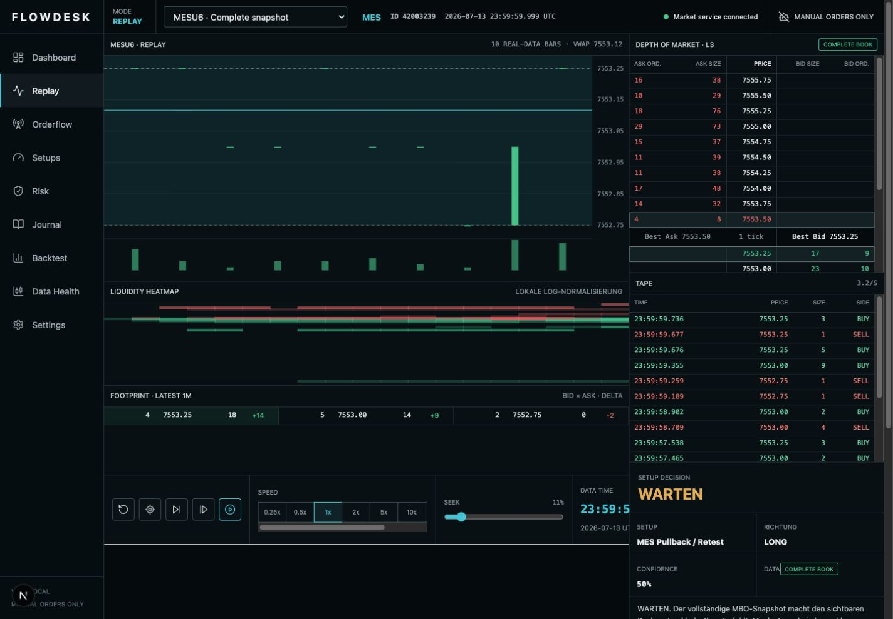

# Flowdesk AWS Research Platform

> Ingestion and processing pipeline for market data on AWS. **16 GB across 81 files, 960M+ events**, processed by Python workers running as ARM64 containers on AWS Fargate.

## Architecture



**Why these services**

| Decision | Reason |
| --- | --- |
| S3 for storage | Cheap, durable, decoupled from compute. Raw data stays immutable. |
| Fargate instead of EC2 | No idle instances, no host patching. Cost only while a job runs. |
| ARM64 containers | Lower cost per vCPU-hour for this workload than x86. |
| Hash + manifest check | A job that crashes must be restartable without processing a file twice. |

**What I learned building it**

The first full run died after 40 minutes. I suspected the code; it was the container memory limit, and it had been in the CloudWatch logs the whole time. Restarting the job then exposed the real problem: nothing prevented a file from being processed twice. That is why every file is now verified by hash before it is read.

Idempotency and recoverability matter more than throughput. Jobs crash. Always.

**Scope and honesty** — this is a research and portfolio project. It contains no real API keys, no raw market data and no broker automation. It places no orders. For complex software parts I worked with documentation and AI assistance; the architecture and the operational decisions are mine and I can explain all of them.

---


## Deutsch

Flowdesk ist ein Portfolio-Projekt fuer lokale Orderflow-Research-Workflows und AWS-orientierte Datenpipeline-Konzepte. Es verbindet deterministisches Replay, L3-Orderbuchrekonstruktion, inkrementelle Microstructure-Features, einen eventgetriebenen Backtester, zeitlich saubere Validierung, manuelle Signale, Challenge-Risikoregeln, lokale Speicherung und einen ersten Cloud-Worker fuer S3-basierte Batch-Verarbeitung.

Flowdesk enthaelt **keine echten API-Keys, keine Rohdaten und keine Broker-Automation**. Das Projekt platziert keine Orders, steuert keinen Broker und verspricht weder Profitabilitaet noch fehlerfreies Trading. Ein Signal ist eine nachvollziehbare Research-Entscheidung mit Datenqualitaet, Invalidation und Risikogrenzen. Die Ausfuehrung bleibt manuell.

### Schnellstart

```bash
cd flowdesk-aws
npm run local:setup
npm run dev:trading
```

Die Konsole zeigt die freien lokalen Ports an, normalerweise `http://localhost:3000` und `http://127.0.0.1:8787`. Mit `Ctrl+C` werden beide Prozesse beendet. Der Starter waehlt automatisch die naechsten freien Ports, falls diese belegt sind.

### Sicherer erster Ablauf

1. `Datenstatus` oeffnen und nur eine mit `POST_SNAPSHOT` und `COMPLETE` markierte Session verwenden.
2. Im `Replay` Book, Tape und Datenqualitaet pruefen, noch ohne Strategie-Promotion.
3. Im `Research Lab` eine kurze Development-Session auswerten.
4. Nur Kandidaten mit realistischer oder gestresster Fill-Annahme und bestandener zeitlicher Validierung promoten.
5. Das Ergebnis zuerst im `Challenge`-Modus manuell und ohne Broker-Automation beobachten.

Der Data Planner darf kostenfreie Metadaten-Schaetzungen abrufen. Er kauft oder laedt keine Daten, solange nicht der separate, schaetzungsspezifische Freigabeablauf mit exakter Bestaetigung durchlaufen wurde.

Ausfuehrliche Anleitung: [Flowdesk in 10 Minuten](docs/FLOWDESK_IN_10_MINUTEN.md), [Research-Plattform](docs/RESEARCH_PLATFORM.md), [Signal Engine](docs/SIGNAL_ENGINE.md), [Data Planner](docs/DATA_PLANNER.md), [Batch-Schutz](docs/BATCH_DOWNLOADS.md) und [Grenzen](docs/LIMITATIONS.md).

## English

Flowdesk is a portfolio project for local orderflow research workflows and AWS-oriented data-pipeline concepts. It combines deterministic replay, L3 book reconstruction, incremental microstructure features, event-driven backtesting, chronological validation, manual signals, challenge risk controls, local storage, and an initial cloud worker for S3-based batch processing.

Flowdesk includes **no real API keys, no raw market data, and no broker automation**. It does not place orders, control a broker, or promise profitable or error-free trading. Signals are auditable research decisions with data quality, invalidation, and risk limits; execution remains manual.

### Quick start

```bash
cd flowdesk-aws
npm run local:setup
npm run dev:trading
```

The console prints the selected local ports, normally `http://localhost:3000` and `http://127.0.0.1:8787`. Stop both processes with `Ctrl+C`. If a port is busy, the launcher selects the next available one.

### Workspaces

- Dashboard: current decision, quality, risk, P&L, and local sessions
- Replay: chart, footprint, heatmap, DOM, tape, replay controls, decision, and risk
- Orderflow: aggression, delta, queue/depth features, candidates, and volume profile
- Setups: conservative MES setup rules and multi-timeframe context
- Risk: manual challenge limits, progress, consistency, and hard trade blocks
- Journal: local CRUD, filters, import/export, and replay snapshots
- Backtest: descriptive protocol reports with conservative costs
- Data Planner: metadata-only estimates, spend limits, explicit authorization, and local reuse
- Research Lab: persistent runs, event backtests, splits, promotion, rejection, and rollback
- Data Health: hashes, snapshot/completeness diagnostics, performance, and capability state
- Settings: data, replay, orderflow, risk, language, and disabled-by-default AI options

### Verification

```bash
npm run local:doctor
npm run test:all
npm run build
```

Useful data commands are documented in [Data Pipeline](docs/DATA_PIPELINE.md). `dataset:estimate` is metadata-only. `dataset:submit` can create a paid Databento batch request and must never be run without reviewing a fresh estimate and intentionally completing its exact confirmation flow.

The first cloud component is documented in [Cloud Worker](docs/CLOUD_WORKER.md). It can inspect or ingest only an already completed Databento Batch job. The worker has no purchase endpoint, streams verified files directly to the private Flowdesk S3 prefix, and keeps automatic order execution disabled.

## Local Data And Secrets

- Raw immutable DBN: `data/databento/raw/`
- Reference and reports: `data/databento/reference/`, `data/databento/reports/`
- Derived Parquet/features: `data/derived/`
- SQLite and DuckDB state: `data/app/`
- Journal exports: `data/journal/`
- Backups: `data/backups/`

Copy required secret values into ignored `.env.local`; never use `NEXT_PUBLIC_*` for `DATABENTO_API_KEY`. The frontend receives no Databento key. Live market-data and broker execution remain disabled by default.



## Research architecture

The binding MES research scope is documented in:

- `docs/FLOWDESK_RESEARCH_BLUEPRINT.md`
- `docs/CONTEXT_DATA_FORMAT.md`

The current system is manual-execution-only. Directional signals remain replay/paper-only until multi-month chronological validation and point-in-time calendar/news coverage pass.
